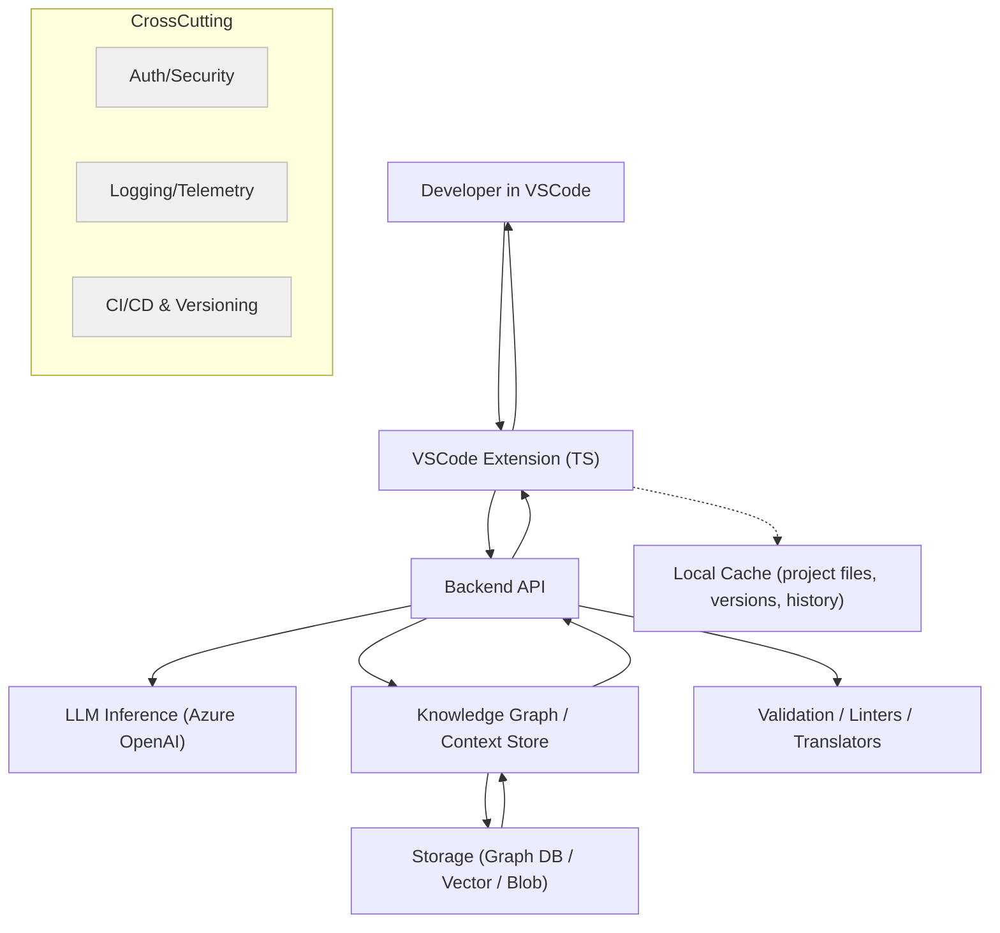

# Agentic AI Coder
Agentic AI Coder is an AI-powered coding assistant that transforms natural language prompts into executable code, enhancing developer productivity and code quality. It automates code generation, debugging, and optimization tasks, providing real-time suggestions and context-aware assistance.

## High-Level Architecture

