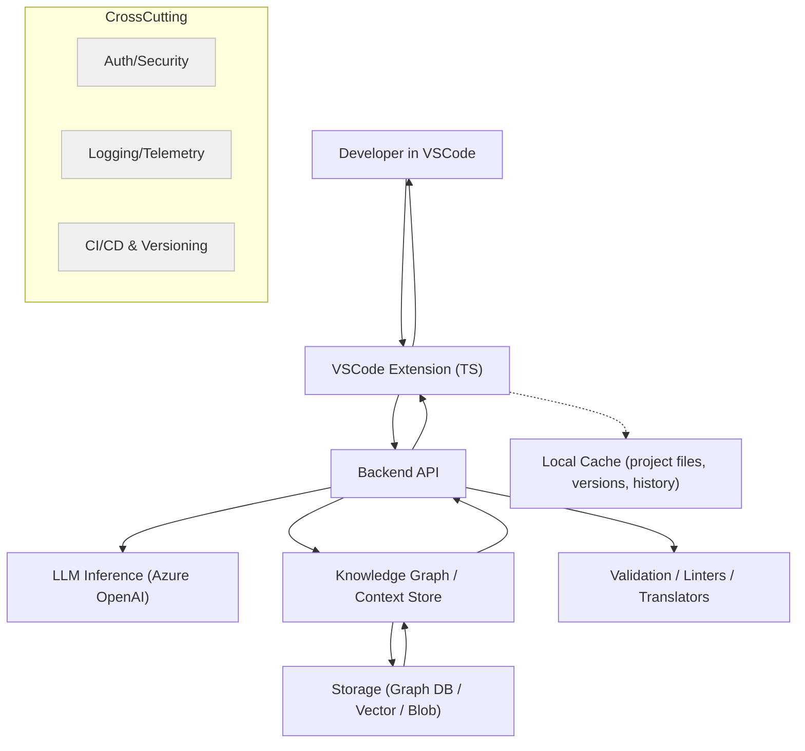

# Agentic Coding Assistant – Project Plan & Phases

Last updated: 2025-10-12

## Overview
This document defines the end-to-end plan to build a VSCode-based AI coding assistant with autocomplete/snippets, bug detection/fix suggestions, code translation, and a project-aware knowledge graph. It covers architecture, phases (POC → MVP → Production), technologies, risks, and a concrete step-by-step execution plan.

## Key Components / Features
- **Autocomplete & snippets**
- **Bug detection & fix suggestions**
- **Code translation between languages**
- **IDE integration (VSCode)**
- **History & context awareness**
- **Knowledge graph of code/docs (structure + relations)**

## High-Level Architecture

### Component Responsibilities
- **VSCode Extension**: capture context (file, selection, edits), provide UI (commands, panels), apply edits/snippets, manage local cache.
- **Backend API**: orchestrate LLM calls, retrieve code context from knowledge graph, run validators/linters/translators, return actionable suggestions.
- **Knowledge Graph / Context Store**: represent code entities (files, modules, classes, functions) and relationships (imports, calls, references, docs); support queries.
- **Storage**: persist graph data, embeddings, history, caches; e.g., Neo4j/Cosmos DB (graph), Azure AI Search (vector), Blob for artifacts.
- **Validation**: static analysis (flake8/mypy for Python, ESLint for JS/TS), policy checks, basic unit validations.
- **Cross-cutting**: authentication, authorization, secrets, telemetry, CI/CD, cost/latency optimizations.

## Data Flow (Simplified)
1. **User action** in VSCode triggers a command (autocomplete/bug/translate).
2. **Extension** gathers lightweight context (current file, selection, open files) and sends request to **Backend**.
3. **Backend** fetches relevant context from **Knowledge Graph/Storage** and prepares the prompt.
4. **LLM** generates suggestions/fixes/snippets. **Validation** optionally runs linters/checkers.
5. **Backend** returns result; **Extension** renders suggestions and applies edits/snippets on accept.

---

## Project Phases

### Phase 1: Proof of Concept (POC)
- **Goal**: Validate that extension + small knowledge graph + LLM can provide meaningful autocomplete, bug detection, and translation on a small Python codebase.
- **Scope**:
  - Language: Python (primary) to limit scope.
  - Features: autocomplete/snippets, basic bug detection, simple translation (Python ↔ JS).
  - Knowledge graph: in-memory or lightweight DB; parse functions/classes/modules + imports.
- **Deliverables**:
  - VSCode extension (command palette trigger + inline suggestions/snippets).
  - Minimal backend (FastAPI) with endpoints: `/generate`, `/lint`, `/translate`.
  - Graph builder for Python using AST to extract entities/relations; simple query interface.
  - Demo on a sample project; basic telemetry.
- **Implementation Steps**:
  - Scaffold extension with `yo code` (TypeScript).
  - Build FastAPI service; wire to Azure OpenAI; implement prompt templates.
  - Implement Python AST parser → graph (in-memory) + dependency extraction.
  - Integrate linters: `flake8`, `mypy` (Python). Return annotated findings + code actions.
  - Implement snippets (VSCode snippets API) and completion provider.
  - Maintain minimal context (last N edits, open files) in the extension.
  - Demo scenarios: autocomplete in context, detect a bug, simple translation.

### Phase 2: MVP
- **Goal**: Improve reliability/usability; support more languages; strengthen knowledge graph and persistence.
- **Scope**:
  - Languages: Python + JS/TS initially; plan for more.
  - Graph: AST-based, persistent (Neo4j or Cosmos DB graph), call graphs, docstrings.
  - Backend: scalable microservices/serverless; Azure Functions or containerized services.
  - Features: better bug detection, customizable snippets/templates, user settings.
- **Deliverables**:
  - Persistent graph store + background indexer for file changes.
  - Azure Functions/API Management or containerized backend with env/dev/prod.
  - Settings UI in extension; improved UX (panels, decorators, inline code actions).
  - Security/auth for cloud features; project-level privacy controls.
- **Implementation Steps**:
  - Extend parsers to JS/TS; enrich relations (calls, references, inheritance).
  - Stand up Neo4j/Cosmos graph; add vector store (Azure AI Search) for embeddings.
  - Migrate endpoints to Functions/API Management; add rate limiting and auth.
  - Expand linter rulesets; add SAST integration (optional).
  - Add snippet library + user templates; telemetry dashboards.

### Phase 3: Scale & Production
- **Goal**: Robust, scalable, maintainable product ready for broader users.
- **Scope**: IaC, CI/CD, monitoring, cost optimization, autoscaling, advanced graph.
- **Deliverables**:
  - IaC (Bicep/Terraform) for backend, storage, graph DB, AI Search.
  - End-to-end CI/CD pipelines for extension + backend + prompt templates.
  - Monitoring, logging, metrics (latency, acceptance, coverage by language).
  - Marketplace-ready VSCode extension (versioning, docs, support flow).
- **Implementation Steps**:
  - Containerize services; autoscale; load balance; caching layers.
  - Incremental graph updates on file change; improved query performance.
  - User settings/profile sync; policy controls; privacy/security hardening.
  - Publish to VSCode Marketplace; support processes.

---

## Technologies & Azure Services

| Piece | Suggested Tech / Azure Service |
|---|---|
| VSCode Extension frontend | Node.js + TypeScript, VSCode Extension API |
| LLM / Code generation / translation | Azure OpenAI Service (gpt-4.x, o series as appropriate) |
| Knowledge Graph / Context Store | AST parsing tooling; Neo4j or Azure Cosmos DB (Graph API); Azure AI Search (vector) |
| Static analysis / bug detection | flake8, mypy (Python); ESLint (JS/TS); optional SAST tooling |
| Storage / History / Caching | Azure Storage (Blob/Table); Azure AI Search vector; local cache in extension |
| Backend / orchestration | FastAPI (POC); Azure Functions / AKS / App Service; Azure API Management |
| Security / Auth | VSCode APIs for workspace permissions; Azure AD; Key Vault; encryption at rest/in transit |
| Logging & Monitoring | Azure Monitor, Application Insights, extension telemetry |

---

## POC Backend API Sketch
- **POST `/generate`**: input { code/context, intent }, output { snippet/completion, rationale }.
- **POST `/lint`**: input { files/paths }, output { findings with ranges, severity, suggested fixes }.
- **POST `/translate`**: input { source_lang, target_lang, code }, output { translated_code, notes }.
- **GET `/context`**: query graph for entities/relations, e.g., "what calls function X?".

## Knowledge Graph (Initial Schema)
- **Entities**: `File`, `Module`, `Class`, `Function`, `Var`, `Doc`.
- **Relations**: `defines`, `imports`, `calls`, `inherits`, `references`, `doc_of`.
- **Attributes**: names, spans (line/col), docstrings, file paths, symbol visibility.
- **Storage (POC)**: in-memory + JSON dump; move to Neo4j/Cosmos in MVP; add embeddings to Azure AI Search.

## VSCode Extension UX (POC → MVP)
- **Triggers**: command palette, context menu, on-type completion provider.
- **Surfaces**: inline ghost text, code actions, side panel for graph queries, quick-fix decorators.
- **Settings**: enable/disable features, language filters, snippet preferences, telemetry opt-in.

## Security & Privacy
- Request only necessary workspace permissions. Avoid uploading entire repos; perform local pre-filtering.
- Anonymize or hash sensitive identifiers before sending to backend; encrypt in transit (TLS) and at rest.
- Use Azure AD for auth to cloud features; store secrets in Key Vault; enforce RBAC.

## Telemetry & Metrics
- Track latency (end-to-end + LLM), suggestion acceptance rates, error rates, usage per language.
- Use Application Insights dashboards; add sampling and PII scrubbing.

## Risks & Mitigations
- **Latency**: cache prompts/results; prefetch context; use function calling/tools; stream partials.
- **Hallucinations**: validate via linters/tests; constrain prompts; provide diffs not full files.
- **Context scope**: rank/prune with embeddings + graph queries; cap token budgets.
- **Graph maintenance**: incremental updates on file change; background indexing.
- **Cost**: cache embeddings; control model usage; batch operations.

---

## Step-by-Step Execution Plan (POC → MVP → Production)

| # | Phase | Task | Owner | Est. | Prereqs | Output/Exit Criteria |
|---:|:---|:---|:---:|:---:|:---|:---|
| 1 | POC | Finalize scope (Python; features: autocomplete, lint, translate) |  | 0.5d |  | Written scope & success criteria |
| 2 | POC | Set up Azure OpenAI and secrets management |  | 0.5d | 1 | Keys in Key Vault; connectivity tested |
| 3 | POC | Scaffold VSCode extension with `yo code` (TS) |  | 0.5d | 1 | Extension runs “Hello World” command |
| 4 | POC | Create FastAPI backend skeleton + `/generate` |  | 1d | 2 | Deployed locally; returns mock completions |
| 5 | POC | Wire Azure OpenAI to `/generate` with prompt templates |  | 1d | 4 | Real completions with context |
| 6 | POC | Implement Python AST parser → in-memory graph |  | 1d | 4 | Entities/relations JSON dump + queries |
| 7 | POC | Add `/lint` using flake8/mypy; return fixes |  | 1d | 4 | Findings with ranges + suggestions |
| 8 | POC | Add `/translate` Python→JS (basic) |  | 0.5d | 5 | Translated code endpoint working |
| 9 | POC | Integrate extension with backend endpoints |  | 1d | 3,4 | Commands invoke backend; display results |
| 10 | POC | Implement snippets/completion provider in extension |  | 1d | 9 | Inline suggestions/snippets insert |
| 11 | POC | Minimal context memory (open files, last N edits) |  | 0.5d | 9 | Context sent with requests |
| 12 | POC | Demo on sample project; collect feedback |  | 0.5d | 10 | Demo recording + notes |
| 13 | MVP | Stand up Neo4j/Cosmos graph; migrate graph storage |  | 2d | 6 | Persistent graph with CRUD/indexer |
| 14 | MVP | Extend parsers to JS/TS; add call graphs/docstrings |  | 2d | 13 | Multi-language graph queries |
| 15 | MVP | Add Azure AI Search vector store + embeddings |  | 1.5d | 13 | Hybrid (graph+vector) retrieval |
| 16 | MVP | Move backend to Azure Functions/API Management |  | 2d | 4 | Auth, throttling, env separation |
| 17 | MVP | Improve bug detection; optional SAST integration |  | 2d | 7 | Expanded rules; security checks |
| 18 | MVP | Snippet library + user templates; settings UI |  | 1.5d | 10 | Configurable templates in extension |
| 19 | MVP | UX polish (panels, decorators, code actions) |  | 1d | 9 | Usability improvements |
| 20 | MVP | Telemetry dashboards (App Insights) |  | 0.5d | 9 | KPIs: latency, acceptance |
| 21 | PROD | Containerize services; autoscaling; caching |  | 2d | 16 | Reliable, cost-optimized infra |
| 22 | PROD | Incremental graph updates on file change |  | 1.5d | 13 | Realtime indexing pipeline |
| 23 | PROD | Security hardening (AAD, RBAC, Key Vault) |  | 1d | 16 | Audited security posture |
| 24 | PROD | IaC (Bicep/Terraform) + CI/CD pipelines |  | 2d | 21 | One-click deploy; env parity |
| 25 | PROD | Publish VSCode extension to Marketplace |  | 1d | 19 | Listed extension; docs/support |

### Milestones & Exit Criteria
- **POC Exit**: Working demo shows (a) autocomplete in context, (b) at least one detected bug with a suggested fix, (c) Python→JS translation example, (d) basic graph query (e.g., callers of function X).
- **MVP Exit**: Persistent graph + multi-language support + deployed backend (Functions/APIM) + settings + telemetry dashboards + improved UX.
- **Production Exit**: IaC + CI/CD + autoscaling + monitoring + hardened security + Marketplace publication.

---

## Next Actions (This Repository)
- **Decide POC language**: Python confirmed.
- **Create extension scaffold** in `test-project/` or a new `vscode-extension/` folder.
- **Create backend folder** in `test-project/backend/` using FastAPI; add `/generate`, `/lint`, `/translate`.
- **Add simple AST graph builder** module and a script to index the workspace.
- **Wire minimal telemetry** (console + simple event logging) for demo.

