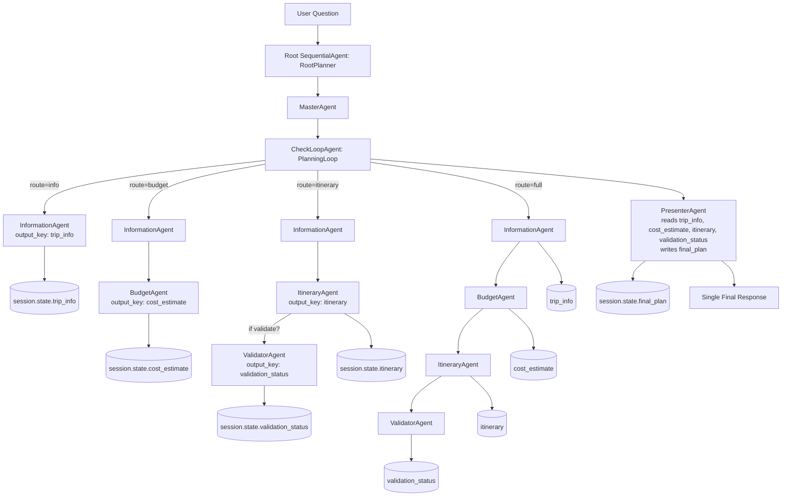

# Architecture: my_agent

## Why this is agentic (not just a bunch of agents)

- **[orchestration]** A top-level coordinator (`root` → `master_agent` → `planning_loop`) governs control flow instead of each agent acting independently. See `my_agent/agent.py`.
- **[routing and policy]** `CheckLoopAgent._run_async_impl()` decides which agents to invoke based on the user’s question (keywords/intent). Different routes (info/budget/itinerary/full) reflect policy-driven control, not a fixed chain.
- **[shared memory]** Agents read/write a common `ctx.session.state` (`trip_info`, `cost_estimate`, `itinerary`, `validation_status`, `final_plan`). This enables context propagation and dependency between steps.
- **[tool-like composition]** Sub-agents are invoked as callable capabilities by the loop, enabling reuse and modularity akin to tools in a plan.
- **[termination control]** The loop yields an escalate event to end execution deterministically after the presenter emits the final message—preventing uncontrolled chatter.
- **[single point of communication]** `presenter_agent` synthesizes a final answer from available state. Intermediate agent outputs are suppressed, so the user sees one coherent response.

## How routing works (high level)

- **[info]** Matches: info, information, flights, hotels, activities, options, agents → runs `InformationAgent` only.
- **[budget]** Matches: budget, cost, price, estimate → runs `InformationAgent` then `BudgetAgent`.
- **[itinerary]** Matches: itinerary, day, schedule, day-wise, plan itinerary → runs `InformationAgent` then `ItineraryAgent`; adds `ValidatorAgent` if validation keywords appear.
- **[full]** Fallback or mixed intents → runs all four sub-agents.