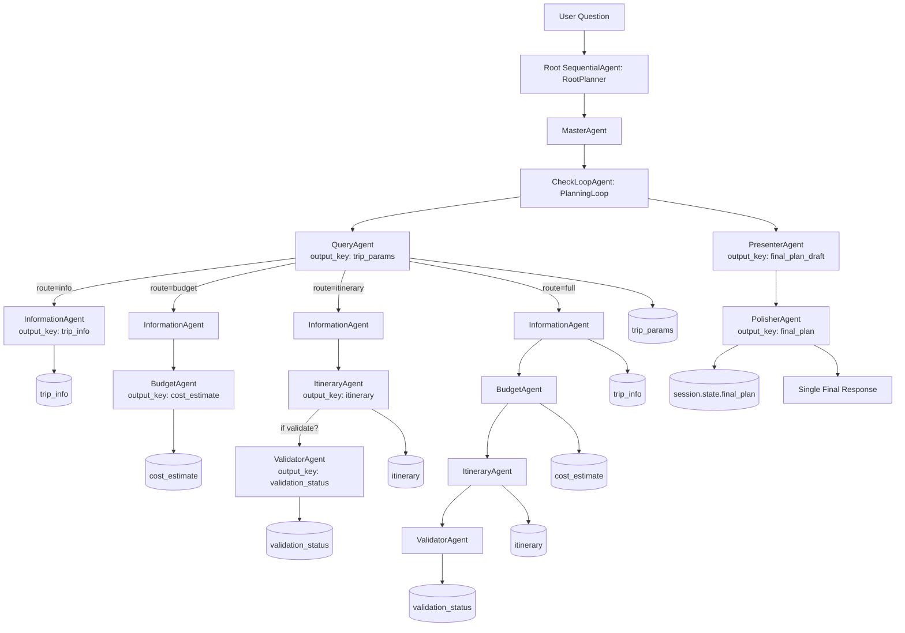

# Architecture: my_agent

## Why this is agentic (not just a bunch of agents)

- **[orchestration]** Top-level control (`root` → `master_agent` → `planning_loop`) plans and invokes sub-capabilities; agents don’t act independently.
- **[routing and policy]** `CheckLoopAgent._run_async_impl()` routes based on intent keywords with precedence. It chooses minimal necessary tools (agents) for the task instead of a fixed chain.
- **[stateful memory]** Agents cooperate through `ctx.session.state` keys like `trip_params`, `trip_info`, `cost_estimate`, `itinerary`, `validation_status`, `final_plan_draft`, `final_plan`.
- **[tool-like agents]** Sub-agents are treated as tools the planner calls in context, enabling reuse and modularity.
- **[quality gate]** A dedicated polishing stage enforces structure and completeness before emitting the final message.
- **[termination control]** The loop escalates after the polisher output, guaranteeing a single visible response per invocation.

## Routing rules (high level)

- **[always first]** `QueryAgent` extracts `trip_params` from the user question.
- **[info]** Keywords: info, information, flights, hotels, activities, options, agents → `InformationAgent`.
- **[budget]** Keywords: budget, cost, price, estimate → `InformationAgent` → `BudgetAgent`.
- **[itinerary]** Keywords: itinerary, day, schedule, day-wise, plan itinerary → `InformationAgent` → `ItineraryAgent`; add `ValidatorAgent` if validate/feasible/valid present.
- **[full]** If both itinerary and budget are requested or nothing matches → run all four sub-agents.